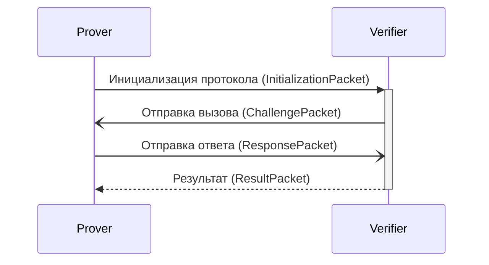

Предлагаемый криптографический протокол ограничения расстояния включает в себя два участника: доказывающую сторону (Prover) и проверяющую сторону (Verifier). Протокол состоит из последовательности обмена пакетами, в которых используется асимметричное шифрование и случайные числа. Для работы протокола требуется предварительная синхронизация ключей по безопасному каналу.

В протоколе используются 4 типа пакетов:

1. пакет инициализации (InitializationPacket) - используется доказывающей стороной для начала процесса оценки расстояния;
2. пакет вызова (ChallengePacket) - используется для отправки числа вызова от проверяющей стороны к доказывающей;
3. пакет ответа (ResponsePacket) - используется для ответа на вызов доказывающей стороной;
4. пакет результата (ResultPacket) - отправляется проверяющей стороной для уведомления о результате проверки.

Каждый пакет содержит следующие поля данных:
- prover_id - Идентификатор доказыающей стороны, отправившей (или для которой предназначается) данный пакет;
- packet_type - тип пакета.

Пакет инициализации дополнительно содержит следующие поля, защифрованные алгоритмом ассиметричного шифрования RSA:
- число-вызов (ChallengeNumber) - предварительно сгенерированное доказывающей стороной число, которое проверяющая сторона должна будет отправить.
- число-ответ (ResponseNumber) - предварительно сгенерированное доказывающей стороной число, которым эта сторона должна будет ответить на вызов.

Пакеты вызова и ответа дополнительно содержат только число-вызов и число-ответ соответственно, хранящиеся в открытом виде.

Пакет результата содержат следующие поля, также зашифрованные с помощью RSA:
- вычисленное расстояние
- успешна ли проверка (находится ли доказывающая сторона в области проверяющей).

Процесс протокола состоит из 4 этапов, представленных на рисунке 1.

Рисунок 1 - Диаграмма последовательности разработанного протокола

1. Доказывающая сторона генерирует 2 числа: ChallengeNumber и ResponseNumber, который шифруются с помощью RSA с использованием открытого ключа проверяющей стороны, предварительного переданного по защищенному каналу; и отправляет пакет инициализации (InitializationPacket) доказывающей стороне. Также создается сессия, в которой сохраняются эти числа, и производится отсчет времени ожидания.
2. Проверяющая сторона, получая пакет инициализации, создает сессию проверки, в которой сохраняются полученные числа и запускается отсчет времени ожидания. В отличие от доказывающей стороны, проверяющая может хранить одновременно несколько активных сессий. После сохранения данных отправляется пакет вызова (ChallengePacket).
3. Доказывающая сторона, получая пакет вызова, отвечает на него только при совпадении полей идентификатора и числа-вызова. Ответом является пакет-ответ (ResponsePacket), содержащий число-ответ, взятое из активной сессии.
4. Проверяющая сторона, получая пакет-ответ с корректными данными, останавливает таймер и производит расчет расстояния на основе полученного времени ожидания и скорости распространения сигналов в среде по формуле (1), где $t$ - длительность проверки, $c$ - скорость распространения сигнала в среде. Полученное расстояние сравнивается с заданным порогом, и отправляется пакет результата проверки (ResponsePacket).

$ d = \dfrac{t}{2} \cdot c $ (1)

